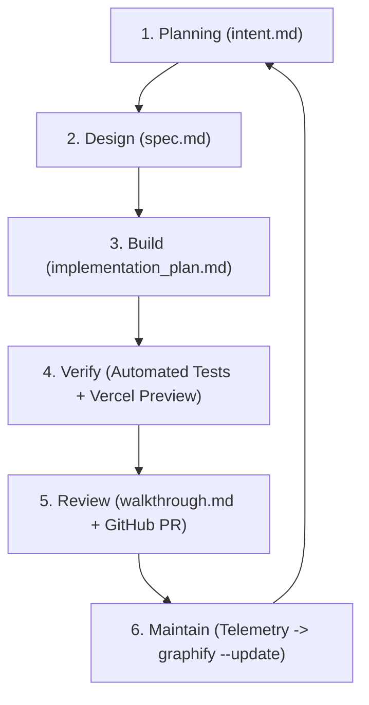

# AI-Native SDLC Plugin for Antigravity & AI Agents

> **The Artifact-Driven, Human-in-the-Loop Software Development Lifecycle Plugin.**  
> Powered by **Graphify** (Knowledge Graph & Error Memory), **Context7** (Live Documentation), **skills.sh** (Dynamic Agent Skills), **GitHub**, and **Vercel**.

---

## Overview

The **AI-Native SDLC** plugin transforms traditional, linear software development into a continuous, artifact-driven agentic loop. Based on the principles from Anthropic's *AI-Native SDLC Playbook*, this plugin equips autonomous coding agents (Antigravity, Claude Code, Cursor, Codex) with:

1. **Graphify Knowledge Graph & Long-Term Memory**: AST codebase mapping, blast-radius impact analysis, and persistent bug/mistake memory across sessions.
2. **Context7 Real-Time Documentation**: Live retrieval of official third-party library, framework, and SDK specifications.
3. **skills.sh Dynamic Skill Discovery**: On-demand package management for domain-specific agent skills.
4. **Machine-Executable Artifact Gates**: Shift architecture and verification left via `intent.md`, `spec.md`, `implementation_plan.md`, and `walkthrough.md`.
5. **GitHub & Vercel MCPs**: Automated issue ingestion, preview deployments, and PR code reviews.

---

## Plugin Architecture

```text
ai-native-sdlc/
├── plugin.json                              # Plugin manifest & metadata
├── README.md                                # Documentation & usage guide
├── hooks.json                               # Antigravity lifecycle hooks configuration
├── mcp_config.json                          # MCP servers: Graphify, Context7, GitHub, Vercel
├── rules/
│   └── AGENTS.md                            # Non-negotiable directives (always_on)
├── scripts/
│   └── sync-graphify.ps1                    # Continuous memory & graph update hook
└── skills/
    └── ai-native-sdlc/
        ├── SKILL.md                         # 6-Stage AI-Native SDLC operational engine
        └── references/
            └── templates/
                ├── intent.template.md       # Stage 1: Planning & non-goals
                ├── spec.template.md         # Stage 2: Architecture & Context7 specs
                ├── implementation_plan.template.md # Stage 3: Phased edits & invariants
                └── walkthrough.template.md  # Stage 5: Summary, evals & PR link
```

---

## The 6 Lifecycle Stages



1. **Planning (`intent.md`)**: Synthesize problem statements, define explicit non-goals, query Graphify for affected subsystems, and discover domain skills with `npx skills find`.
2. **Architecture & Design (`spec.md`)**: Validate contracts against Context7 official docs and document Architectural Decision Records (ADRs).
3. **Implementation (`implementation_plan.md`)**: Draft atomic, phased execution plans before making surgical code changes.
4. **Verification & Testing**: Execute test suites synchronously and validate against Vercel preview environments.
5. **Review & Delivery (`walkthrough.md`)**: Produce high-signal summaries, automated review notes, and open GitHub Pull Requests.
6. **Maintenance & Memory**: Ingest operational feedback, commit new invariants to the knowledge graph with `graphify --update`, and update skills via `npx skills update -g`.

---

## Installation & Usage

### Installing with `skills.sh`
```bash
npx skills add skysthelimitpainting1779-collab/ai-native-sdlc -g
```

### Installing in Antigravity Customizations
Clone directly into your global plugins directory:
```bash
git clone https://github.com/skysthelimitpainting1779-collab/ai-native-sdlc.git ~/.gemini/config/plugins/ai-native-sdlc
```

---

## Non-Negotiable Directives

- **Research First**: Never act on assumptions.
- **Graphify First**: Query `graphify-out/graph.json` before touching complex codebases.
- **Context7 First**: Resolve and verify third-party API contracts against official live docs.
- **Artifacts First**: Non-trivial changes must have an approved plan artifact before editing files.
- **Zero Silent Failures**: Throw explicit errors, fail fast, and maintain strict typing.

---

## License
Apache-2.0 © Antigravity Engineering & Sky's the Limit Painting LLC.
