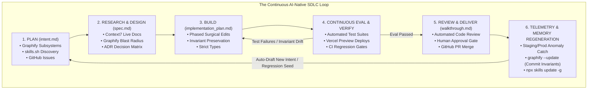

# The AI-Native SDLC Continuous Loop Engine

This skill operationalizes the AI-Native Software Development Lifecycle as an **unbroken, continuous closed loop**. Rather than a static linear pipeline, every stage dynamically informs, verifies, and feeds the next, with production learnings continuously regenerating intent.

---

## 🔄 The Closed-Loop Architecture

---

## 🛠️ Tool & Knowledge Discovery Engine

1. **Graphify Knowledge Graph (`graphify-out/graph.json`)**:
   - Continuous AST mapping, God-node blast radius, and historical mistake memory.
   - Core commands: `query_graph`, `get_node`, `shortest_path`, `graphify path`, `graphify explain`.

2. **Context7 Live Documentation Engine**:
   - Real-time API contract verification for third-party libraries and frameworks.
   - Core workflow: `resolve-library-id` -> `query-docs`.

3. **skills.sh Dynamic Capability Package Manager (`npx skills`)**:
   - On-demand runtime skill resolution: `npx skills find` -> `npx skills add -g` -> `npx skills update -g`.

---

## 🔁 Continuous Loop Stage Execution Runbook

### Stage 1: Planning & Intent Synthesis (`intent.md`)
- Ingest GitHub issues, user requests, or telemetry seeds from Stage 6.
- Run `query_graph` to inspect affected subsystems and prior incident nodes.
- Run `npx skills find` to acquire missing domain skills.
- Produce `intent.md` with explicit non-goals and exit criteria.

### Stage 2: Architecture Research & Specification (`spec.md`)
- Launch `sdlc-researcher` or execute `architecture-research-verification`.
- Resolve external API specs via Context7 (`resolve-library-id` -> `query-docs`).
- Map dependency paths via Graphify (`shortest_path`).
- Produce `spec.md` with strict schemas and ADR trade-offs.

### Stage 3: Surgical Implementation (`implementation_plan.md`)
- Formulate phased `implementation_plan.md` before editing files.
- Apply surgical edits adhering to DRY, KISS, and strict typing.
- Never write silent try/catch blocks that swallow errors.

### Stage 4: Continuous Evaluation & Preview Loop
- Execute unit/integration test suites and evaluate against `evals/sdlc_eval_suite.json`.
- Deploy staging preview via Vercel MCP / CLI.
- **Auto-Healing Loop**: If tests fail or type errors occur, loop back to Stage 3 immediately with failure context.

### Stage 5: Delivery, Review & PR Package (`walkthrough.md`)
- Run automated first-pass review (safety, style, invariants).
- Generate `walkthrough.md` with test evidence, preview URLs, and diffs.
- Open GitHub Pull Request via GitHub MCP (`create_pull_request`).
- Await human-in-the-loop approval for high-risk boundaries.

### Stage 6: Telemetry, Memory Commit & Intent Regeneration
- On merge, run `scripts/sync-graphify.ps1` (`graphify --update`) to commit new architectural invariants and bug resolutions to the knowledge graph.
- Update installed skills with `npx skills update -g`.
- When anomalies or new requirements surface, auto-seed the next iteration at Stage 1.
