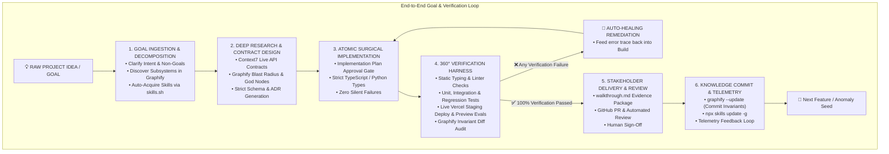

# The AI-Native SDLC Autonomous Goal & Verification Engine

This skill empowers Antigravity to take **any raw project idea, feature request, or architectural goal** and execute an unbroken, autonomous verification loop that leaves zero technical debt or unverified assumptions.

---

## 🎯 Goal Ingestion to 360° Verification Loop

---

## 🔍 The 360° Verification Matrix

Before any project idea, feature, or refactor is considered complete, it MUST pass all 5 verification gates:

| Verification Layer | Tool / Engine | Pass Criteria |
| :--- | :--- | :--- |
| **1. Type & Contract Safety** | Strict Compiler / Mypy | Zero `any`, zero untyped params, strict null checks pass. |
| **2. Codebase Invariant Integrity** | Graphify Knowledge Graph | `shortest_path` and `get_pr_impact` confirm zero broken dependencies or unhandled regressions. |
| **3. External API Conformance** | Context7 Live Docs | All external library/API usage conforms 100% to verified official documentation. |
| **4. Functional & Regression Testing**| Pytest / Jest / Playwright | All test suites pass; newly created test cases cover all edge cases identified in `intent.md`. |
| **5. Live Runtime Staging** | Vercel MCP / Preview URL | Clean preview build with zero runtime console errors and verified visual endpoints. |

---

## 🔁 Stage-by-Stage Operational Runbook

### Stage 1: Goal Ingestion & Intent Definition (`intent.md`)
- **Action**: Take the user's raw prompt/goal and formalize it into `intent.md`.
- **Knowledge Lookups**:
  - Run `query_graph` or `graphify query` to locate existing modules and historical incident nodes.
  - Run `npx skills find <domain>` to dynamically download required ecosystem skills.
  - Define clear **In-Scope** vs. **Explicit Non-Goals** to protect against scope creep.

### Stage 2: Architecture Research & Specification (`spec.md`)
- **Action**: Launch `sdlc-researcher` or execute `architecture-research-verification`.
- **Authoritative Specs**:
  - Resolve official library IDs with Context7 (`resolve-library-id` -> `query-docs`).
  - Draft `spec.md` with explicit data models and Architectural Decision Records (ADRs).

### Stage 3: Surgical Phased Implementation (`implementation_plan.md`)
- **Action**: Formulate `implementation_plan.md` breaking changes into atomic steps.
- **Execution**: Apply surgical edits with strict typing, zero-debt refactoring, and fail-fast exception handling.

### Stage 4: 360° Continuous Verification Loop
- **Action**: Run the complete automated test suite and evaluate against `evals/sdlc_eval_suite.json`.
- **Preview Deploy**: Trigger Vercel staging deployment and audit runtime performance.
- **Auto-Healing**: If any check fails, feed the error trace immediately back into Stage 3 to resolve the issue autonomously.

### Stage 5: Delivery & PR Review (`walkthrough.md`)
- **Action**: Package all changes, test outputs, diffs, and preview links into `walkthrough.md`.
- **Pull Request**: Open or update the GitHub Pull Request via GitHub MCP (`create_pull_request`).

### Stage 6: Persistent Memory & Intent Regeneration
- **Action**: Run `scripts/sync-graphify.ps1` (`graphify --update`) to commit new architectural invariants into `graphify-out/graph.json`.
- **Continuous Evolution**: Auto-draft subsequent `intent.md` artifacts as runtime telemetry or new goals emerge.
